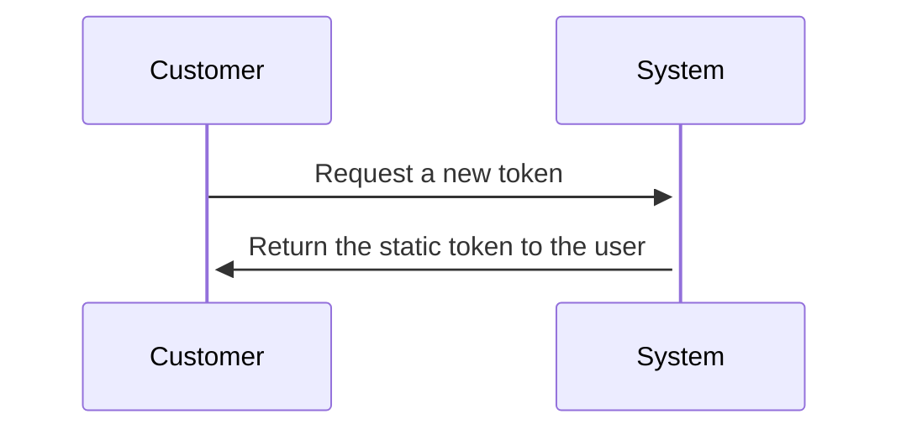
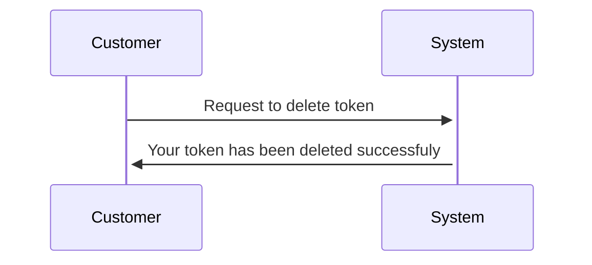
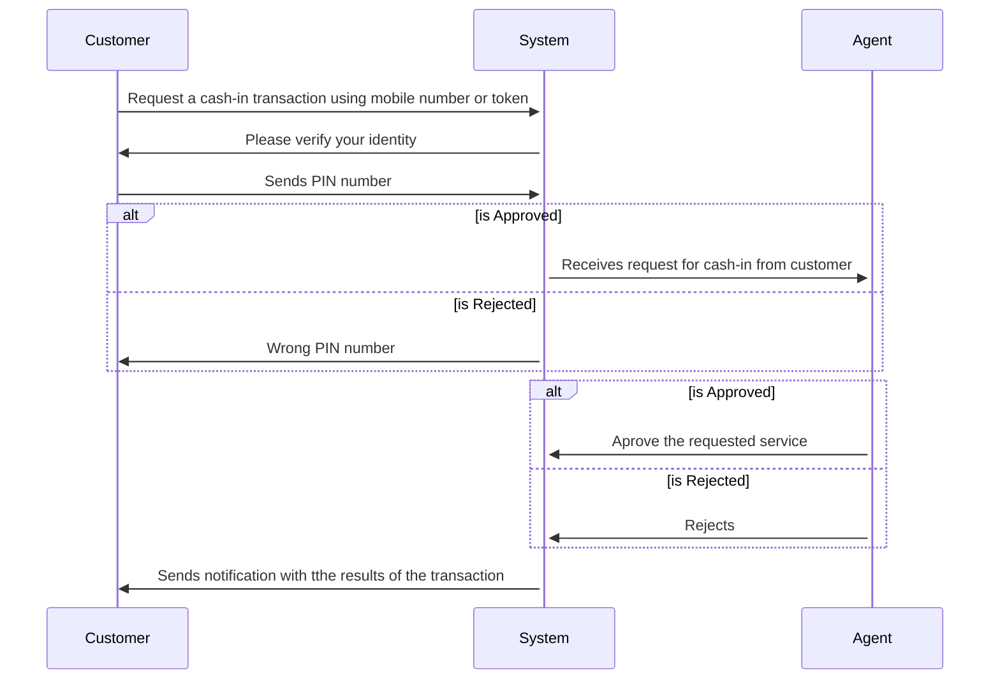
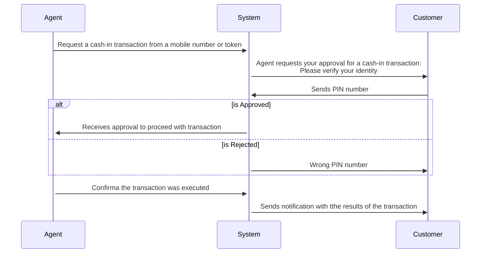
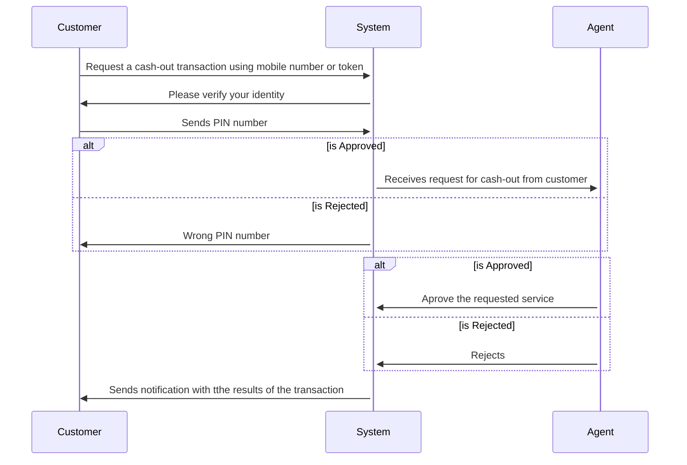
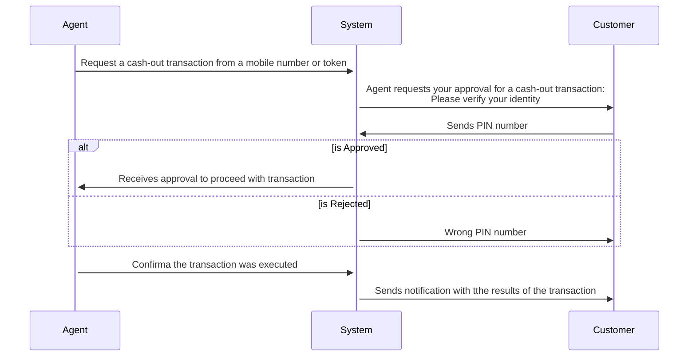

# **Use Cases**

The Tokenisation Project has currently 3 different mobile money Use Cases (UCs): **Cash-in, Cash-out, and Payments**.  Each use case embraces several scenarios to approach the different possible paths. These UC were selected after collecting information with Mobile Money Operators and based on the importance of the use of token on these cases. Besides these main use cases, the scenarios to create a token and delete were also create based on the use cases: **Get Token and Delete Token**.

<aside>
📬 If anyone wish to propose a new Use Case or a new User Scenario. Please send as an email trough the token page website.

</aside>

<aside>
🎯 Remember that all use cases and scenarios described here can be easily customise to adapt to any mobile operator needs.

</aside>

To execute the use cases, the user can be play two different roles in the interface:

**Mobile Money Customer:** The user can play the customer role using the virtual phone interface, in the web simulation version, and using real phone device for the live simulation version. 

**Mobile Money Agent:** The user can also play the role of an agent, using the web interface to approve or reject transactions, or to start transactions in agent-initiated or merchant-initiated scenarios.

Following you can see some examples of the use case scenarios and diagram flows. It is important to mention that there are several other possibilities to test this show case. in the section list of use case scenarios you can check it out the many paths the customer can take.

## **Get Token**

---

The user can request a new token by anytime. For showcase purposes,  If the user already has a token, the same will be deleted and a new token will be generated to replace the previous one. 

### **Scenario**

The customer wants to tokenise a phone number, so they will request to the token service to get a token to their number. The token service will send back the customer's token number.

### Diagram

## Delete Token

---

The user can delete an existent token by anytime. When a token is deleted the user can only proceed with transactions using the mobile number, until a new token is requested. 

### **Scenarios**

- This scenario occurs when a customer wants to delete the current token. This can happen for many reasons: the customer just wants a new one, the token was disclosed to someone and the user does not feel safe, and many other reasons. So, the customer request the deletion/invalidation of the token through the command delete token.

### Diagram

## Cash-In

---

This use case approaches scenarios where a mobile money customer wants to deposit money into their mobile money account. 

### **Scenarios**

**Customer Initiated Cash-in**

A customer wants to initiate a cash-in transaction on his device. So, they input the amount, authorise the transaction with the PIN and let the agent know that a cash-in transaction was initiated. The Agent asks for the customer **mobile number** or **token**. With this information the agent approves the transaction. 

**Agent Initiated Cash-in**

A customer wants to make a cash-in transaction and request the agent to proceed with the cash-in. The agent asks for the customer's **mobile number** or **token.** With this information the agent starts the transaction, requiring the approval of customer in their mobile device. 

### Diagram

**Customer Initiated Cash-in**

**Agent Initiated Cash-in**

## Cash-Out

---

This use case approaches scenarios where a mobile money customer wants to obtain money from their mobile money account. 

### **Scenarios**

**Customer Initiated Cash-out**

A customer wants to initiate a cash-out transaction on his device. So, they input the amount, authorise the transaction with the PIN and let the agent know that a cash-in transaction was initiated. The Agent asks for the customer **mobile number** or **token**. With this information the agent approves the transaction. 

**Agent Initiated Cash-out**

A customer wants to make a cash-out transaction and request the agent to proceed with the cash-out. The agent asks for the customer's **mobile number** or **token.** With this information the agent starts the transaction, requiring the approval of customer in their mobile device. 

### Diagram

**Customer Initiated Cash-out**

**Agent Initiated Cash-in**

## Payments

---

The payment use case approaches any scenarios where a customer wants to make a payment using their mobile money account. The payment can be seen as a merchant payment, a P2P transaction, bills payments, and so forth. 

### **Scenarios**

**Customer Initiated Payment**

A customer wants to initiate a payment transaction on his device. So, they input the amount, authorise the transaction with the PIN and let the merchant to know about the payment. The Agent asks for the customer **mobile number** or **token**. With this information the agent approves the transaction. 

**Agent Initiated Payment**

A customer wants to make a payment transaction and request the agent to proceed with the payment. The agent asks for the customer's **mobile number** or **token.** With this information the agent starts the transaction, requiring the approval of customer in their mobile device, including a PIN number for authorisation. 

### Diagram

**Customer Initiated Payment**

**Agent Initiated Payment**